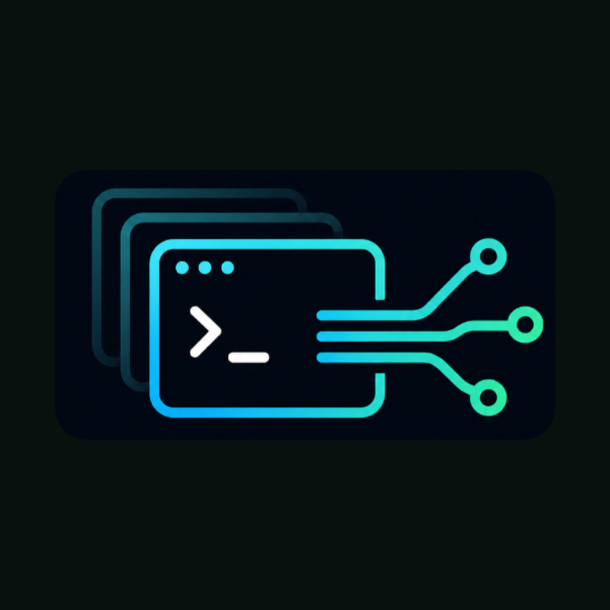
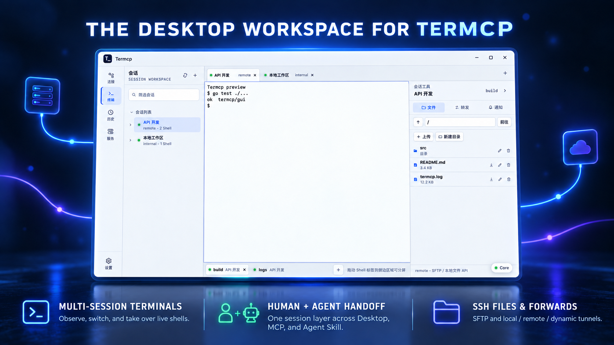
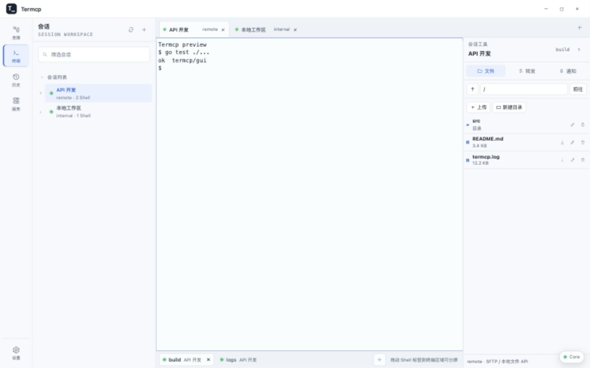
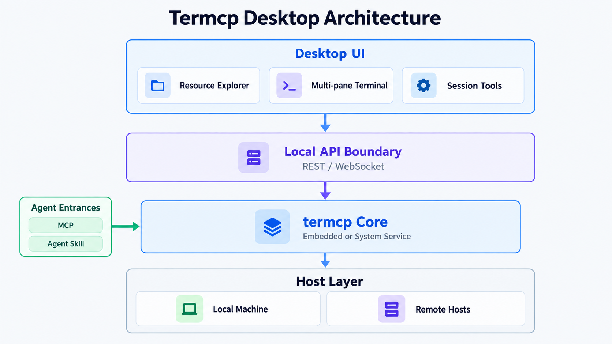

<div id="top">

<p align="center">
  
</p>

<p align="center">
  <a href="https://github.com/open-mcp-ai/Termcp-Desktop">
    
  </a>
</p>

<h1 align="center">⚡ Termcp Desktop</h1>

<p align="center"><strong>A cross-platform desktop manager and SSH workspace for termcp</strong></p>

<p align="center">
  Manage the Core, SSH connections, multi-pane terminals, files, port forwards, and session history in one native desktop app.
</p>

<p align="center">
  <a href="https://github.com/open-mcp-ai/Termcp-Desktop/stargazers"></a>
  <a href="https://github.com/open-mcp-ai/Termcp-Desktop/releases"></a>
  <a href="./LICENSE"></a>
</p>

<p align="center">
  
  
  
</p>

<p align="center">
  <strong>English</strong> | <a href="./README.zh.md">中文</a>
</p>

<p align="center">
  <a href="#overview"></a>
  <a href="#features"></a>
  <a href="#quick-start"></a>
  <a href="#architecture"></a>
  <a href="#development"></a>
</p>

<p align="center">
  
</p>



<p align="center"><sub>Artwork derived from the real Termcp Desktop workspace layout</sub></p>

<a id="overview"></a>

## Overview

**Termcp Desktop** is the native desktop client for [termcp](https://github.com/open-mcp-ai/termcp). It brings Core lifecycle management, SSH resources, and real PTY terminals into a cross-platform window so humans and AI agents can share, observe, and take over the same sessions.

This is not an Electron wrapper. The desktop shell uses [Wails v2](https://wails.io/docs/introduction/) and the system WebView. The termcp Core is embedded as a Go module, while the GUI communicates with it through the same stable REST and WebSocket boundary.

- **Desktop users** manage connections, sessions, shells, files, and forwards through an explorer-style interface.
- **AI agents** operate the same real terminals through termcp's MCP server or Agent Skill.
- **System services** keep the Core and its sessions running after the GUI is closed.

### Interface



<p align="center"><sub>The real interface: sessions, multi-shell terminals, SFTP file management, and Core status in one workspace</sub></p>

<a id="features"></a>

## Features

- **Real terminal workspace** — xterm exchanges real PTY bytes through `/api/ui/ws`, synchronizes resize events, and restores scrollback with output-range loading.
- **Multiple sessions and panes** — workspace tabs, up to four panes, horizontal/vertical/tiled layouts, adjustable ratios, pane maximization, and persisted layouts.
- **Complete SSH connection lifecycle** — create, edit, test, and delete connection profiles, then open sessions and shells directly from them.
- **Files and port forwarding** — browse local/SFTP files, upload, download, rename, and create directories; configure Local, Remote, and Dynamic forwards.
- **Replayable history** — search closed sessions, edit tags and notes, read captured output, and export Markdown or PNG screenshots.
- **Core and system-service management** — install, uninstall, start, stop, restart, and configure autostart. Closing the desktop window does not stop a registered Core service.
- **Native desktop experience** — single-instance behavior, system tray controls, window wake-up, and native packages for macOS, Windows, and Linux.
- **English and Simplified Chinese UI** — switch the application and tray menus immediately from Settings.
- **Observable and private by default** — desktop, Core-service, Wails-binding, and REST operations use structured JSON Lines logs without passwords, private keys, tokens, or request bodies.

See the [API coverage matrix](docs/api-coverage.md) for the desktop implementation of the Core WebUI contract.

<a id="quick-start"></a>

## Quick Start

### Download the desktop app

Download the latest package for your platform from [GitHub Releases](https://github.com/open-mcp-ai/Termcp-Desktop/releases/latest):

| Platform | Release artifacts |
| :--- | :--- |
| Windows x64 | NSIS installer and portable ZIP |
| macOS Apple Silicon | DMG and ZIP |
| macOS Intel | DMG and ZIP |
| Linux x64 | `tar.gz` |

Termcp Desktop starts the Core on `127.0.0.1:18765` and stores data in `~/.termcp` by default (`%USERPROFILE%\.termcp` on Windows). If the Core is already registered as a system service, the app attaches to that service instead of starting a second instance.

### Run from source

Requirements: **Go 1.25.9+**, **Node.js**, and **npm**.

```bash
git clone https://github.com/open-mcp-ai/Termcp-Desktop.git
cd Termcp-Desktop
npm run dev:wails
```

To review the interface without a Wails bridge, start the browser preview with sanitized demo data:

```bash
npm run dev
# http://127.0.0.1:4173
```

<a id="architecture"></a>

## Architecture



The Core remains the single source of truth for terminal sessions and SSH resources. The desktop client can only access the local Core API through a restricted bridge; it does not accept arbitrary external URLs. See [Architecture](docs/architecture.md) for the complete boundary and lifecycle design.

<a id="development"></a>

## Development

```bash
# Native Wails development window
npm run dev:wails

# Frontend-only preview with sanitized demo data
npm run dev

# Frontend tests, production build, and Go tests
npm test

# Syntax checks, all tests, and go vet
npm run check

# Build the native app for the current platform
npm run build
```

On macOS, the build output is `build/bin/Termcp.app`. Windows produces `Termcp.exe`, and Linux produces a native executable. Release packages should be built on their target operating systems so they use the corresponding WebView and packaging toolchain.

### Project structure

```text
frontend/          Resource explorer, terminal workspace, and browser preview
internal/config/   Product settings, data directory, and service registration
internal/core/     Embedded Core lifecycle and service entry point
internal/bridge/   Restricted API bridge and native upload/download
internal/logging/  Structured logs, rotation, redaction, and cleanup
internal/tray/     macOS, Windows, and Linux system tray integrations
docs/              Product, architecture, API coverage, and verification notes
prototype/         Archived interaction prototypes
```

### System service

| Platform | Manager | Service definition | Autostart scope |
| :--- | :--- | :--- | :--- |
| macOS | LaunchAgent | `~/Library/LaunchAgents/ai.openmcp.termcp.desktop.core.plist` | Current user login |
| Linux | systemd user service | `~/.config/systemd/user/ai.openmcp.termcp.desktop.core.service` | Current user login; linger is supported |
| Windows | Service Control Manager | `termcp-desktop-core` | System startup; service changes request UAC |

### Logs and data

- Data directory: `~/.termcp`
- Log directory: `~/.termcp/logs`
- Default log level: `debug`
- Rotation: 10 MiB per file or daily, retained for 14 days
- Permissions: log files `0600`, log directory `0700`

## CI and Releases

GitHub Actions runs frontend tests, production builds, Go unit tests, coverage collection, `go vet`, and native Wails builds on Windows, Linux, and macOS. Pushing a strict `vX.Y.Z` tag creates a release after all checks pass and publishes `SHA256SUMS` alongside the platform packages.

## Security Boundary

- The Core listens on loopback by default; the desktop bridge rejects external URLs and paths outside `/api/`.
- SSH passwords, private keys, passphrases, and authentication tokens are never written to logs.
- The embedded Core and registered Core service share the same user-protected data directory.
- If you expose the Core remotely, follow [termcp's authentication and security model](https://github.com/open-mcp-ai/termcp#authentication).

## License

Termcp Desktop is licensed under the [Apache License 2.0](LICENSE). Third-party components retain their respective licenses and copyright notices; see [THIRD_PARTY_NOTICES.md](THIRD_PARTY_NOTICES.md).

## Friendly Links

<p align="center">
  <a href="https://linux.do">
    
  </a>
</p>

<p align="right"><a href="#top">Back to top ↑</a></p>
