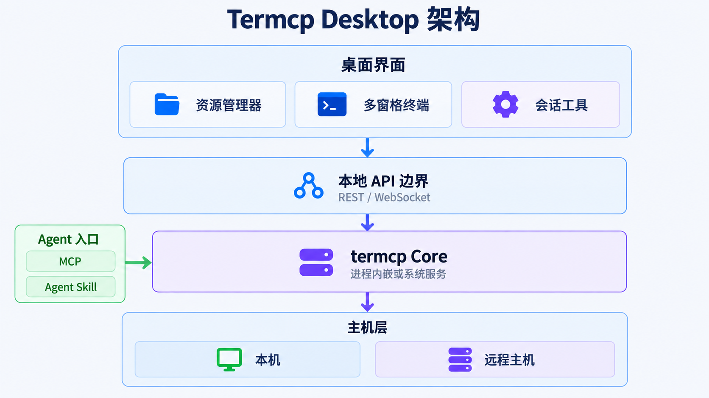

<div id="top">

<p align="center">
  
</p>

<p align="center">
  <a href="https://github.com/open-mcp-ai/Termcp-Desktop">
    
  </a>
</p>

<h1 align="center">⚡ Termcp Desktop</h1>

<p align="center"><strong>termcp 的跨平台桌面管理端与 SSH 工作台</strong></p>

<p align="center">
  在一个原生桌面应用中管理 Core、SSH 连接、多窗格终端、文件、端口转发与历史会话。
</p>

<p align="center">
  <a href="https://github.com/open-mcp-ai/Termcp-Desktop/stargazers"></a>
  <a href="https://github.com/open-mcp-ai/Termcp-Desktop/releases"></a>
  <a href="./LICENSE"></a>
</p>

<p align="center">
  
  
  
</p>

<p align="center">
  <a href="./README.md">English</a> | <strong>中文</strong>
</p>

<p align="center">
  <a href="#overview"></a>
  <a href="#features"></a>
  <a href="#quick-start"></a>
  <a href="#architecture"></a>
  <a href="#development"></a>
</p>

<p align="center">
  
</p>


<p align="center"><sub>基于 Termcp Desktop 真实工作台布局派生的艺术主视觉</sub></p>

<a id="overview"></a>

## 项目介绍

**Termcp Desktop** 是 [termcp](https://github.com/open-mcp-ai/termcp) 的桌面端：它将 Core 生命周期、SSH 资源管理和真实 PTY 终端放进一个跨平台原生窗口，让人类与 AI Agent 可以继续共享、观察和接管同一批会话。

它不是 Electron 封装。桌面壳使用 [Wails v2](https://wails.io/docs/introduction/)，前端由系统 WebView 渲染；termcp Core 作为 Go 模块集成在同一应用中，GUI 与 Core 之间仍使用稳定的 REST / WebSocket 边界。

- **桌面用户** — 在资源管理器式界面中管理连接、会话、Shell、文件和转发。
- **AI Agent** — 通过 termcp 的 MCP / Agent Skill 操作同一批真实终端。
- **系统服务** — 可将 Core 注册为后台服务，关闭 GUI 后会话仍可持续运行。

### 界面


<p align="center"><sub>真实界面：会话列表、多 Shell 终端、SFTP 文件管理与 Core 状态集成在同一工作台中</sub></p>

<a id="features"></a>

## 核心能力

- **真实终端工作台** — xterm 通过 `/api/ui/ws` 收发 PTY 字节流，支持 resize、滚动历史恢复与 output-range 补载。
- **多会话与多窗格** — 工作区标签、最多四窗格、左右/上下/平铺布局、比例调整、窗格最大化和布局持久化。
- **SSH 连接全生命周期** — 创建、编辑、测试和删除连接配置，并从配置直接创建会话与 Shell。
- **文件与端口转发** — 本地/SFTP 文件浏览、上传、下载、重命名和目录管理；Local / Remote / Dynamic 转发集中配置。
- **历史可回放** — 搜索已结束会话，编辑标签与备注，查看正文，导出 Markdown 或 PNG 截图。
- **Core 与系统服务管理** — 注册、卸载、启动、停止、重启和开机自启，关闭桌面窗口不会停止已注册的 Core。
- **原生桌面体验** — 单实例、系统托盘、窗口唤醒，以及 macOS、Windows 和 Linux 原生打包。
- **中英文界面** — 应用和托盘菜单均支持简体中文/英文即时切换。
- **可观测且默认脱敏** — 桌面端、Core 服务、Wails 绑定与 REST 操作写入 JSON Lines 日志，不记录密码、私钥、令牌和请求正文。

Core WebUI 规范接口的桌面端覆盖情况见 [API 覆盖表](docs/api-coverage.md)。

<a id="quick-start"></a>

## 快速开始

### 下载桌面应用

从 [GitHub Releases](https://github.com/open-mcp-ai/Termcp-Desktop/releases/latest) 下载对应平台的最新版本：

| 平台 | 发布产物 |
| :--- | :--- |
| Windows x64 | NSIS 安装器、便携版 ZIP |
| macOS Apple Silicon | DMG、ZIP |
| macOS Intel | DMG、ZIP |
| Linux x64 | `tar.gz` |

Termcp Desktop 默认只在 `127.0.0.1:18765` 启动 Core，并将数据保存在 `~/.termcp`（Windows 为 `%USERPROFILE%\.termcp`）。如果已将 Core 注册为系统服务，应用会连接现有服务，而不是重复启动。

### 从源码运行

需要 **Go 1.25.9+**、**Node.js** 和 **npm**。

```bash
git clone https://github.com/open-mcp-ai/Termcp-Desktop.git
cd Termcp-Desktop
npm run dev:wails
```

如果只需要审阅界面，可启动带脱敏演示数据的浏览器预览：

```bash
npm run dev
# http://127.0.0.1:4173
```

<a id="architecture"></a>

## 架构



Core 始终是终端会话与 SSH 资源的单一事实来源。桌面端仅通过受限桥接访问本机 Core API，不接受任意外部 URL。详见 [架构说明](docs/architecture.md)。

<a id="development"></a>

## 开发

```bash
# Wails 原生开发窗口
npm run dev:wails

# 前端预览（脱敏演示数据）
npm run dev

# 前端测试 + 生产构建 + Go 测试
npm test

# 语法检查 + 全部测试 + go vet
npm run check

# 构建当前平台原生应用
npm run build
```

macOS 构建结果位于 `build/bin/Termcp.app`。Windows 产出 `Termcp.exe`，Linux 产出原生可执行文件。发布构建应在各目标操作系统上分别执行，以使用对应的 WebView 与打包工具链。

### 项目结构

```text
frontend/          资源管理器界面、终端工作台与浏览器预览
internal/config/   产品配置、数据目录与系统服务注册
internal/core/     进程内 Core 生命周期与服务入口
internal/bridge/   受限 API 桥与原生上传/下载
internal/logging/  结构化日志、轮转、脱敏与清理
internal/tray/     macOS / Windows / Linux 系统托盘
docs/              产品、架构、API 覆盖与验证记录
prototype/         前期交互原型归档
```

### 系统服务

| 平台 | 管理方式 | 服务定义 | 自启范围 |
| :--- | :--- | :--- | :--- |
| macOS | LaunchAgent | `~/Library/LaunchAgents/ai.openmcp.termcp.desktop.core.plist` | 当前用户登录 |
| Linux | systemd 用户服务 | `~/.config/systemd/user/ai.openmcp.termcp.desktop.core.service` | 当前用户登录；可配置 linger |
| Windows | Service Control Manager | `termcp-desktop-core` | 系统启动；变更服务时请求 UAC |

### 日志与数据

- 数据目录：`~/.termcp`
- 日志目录：`~/.termcp/logs`
- 默认级别：`debug`
- 轮转策略：单文件 10 MiB 或跨日轮转，保留 14 天
- 权限：日志文件 `0600`，日志目录 `0700`

## CI 与发布

GitHub Actions 在 Windows、Linux 和 macOS 上运行前端测试、生产构建、Go 单元测试、覆盖率采集、`go vet` 与 Wails 原生构建。推送严格的 `vX.Y.Z` 标签会在检查通过后创建 Release，并附带 `SHA256SUMS`。

## 安全边界

- Core 默认仅监听 loopback，桌面桥拒绝外部 URL 与非 `/api/` 路径。
- SSH 密码、私钥、口令和认证令牌不会写入日志。
- 进程内 Core 与系统 Core 服务共用同一个受用户权限保护的数据目录。
- 远程暴露 Core 时，请遵循 [termcp 的认证与安全模型](https://github.com/open-mcp-ai/termcp#authentication)。

## 许可证

Termcp Desktop 使用 [Apache License 2.0](LICENSE)。第三方组件保留各自的许可证与版权声明，见 [THIRD_PARTY_NOTICES.md](THIRD_PARTY_NOTICES.md)。

## 友情链接

<p align="center">
  <a href="https://linux.do">
    
  </a>
</p>

<p align="right"><a href="#top">返回顶部 ↑</a></p>
