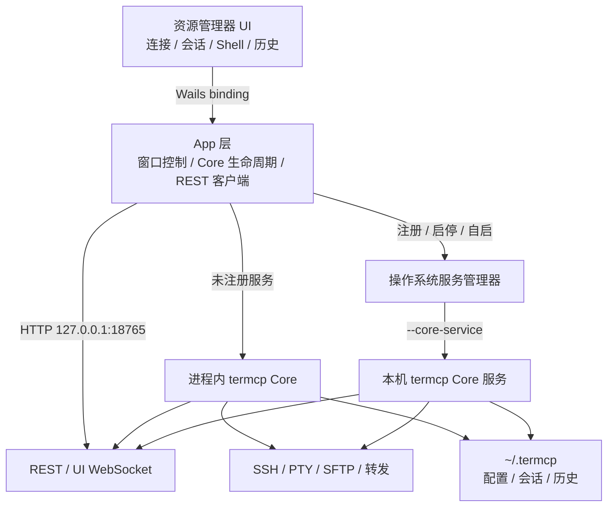

# termcp-gui 架构

## 分层

界面不重新实现 SSH。它只编排 termcp 的连接配置和会话资源。这样 MCP、WebUI 和 GUI 看到同一批会话、Shell、历史与转发。

## Core 生命周期

应用只管理固定在 `127.0.0.1:18765` 的本机 Core：

1. 未注册系统服务时，在 Wails 进程内构造 termcp 的 SSH server、storage、message、history、session、sshconfig、forward、MCP 和 WebUI handler。
2. 注册服务时，先停止进程内 Core，再写入平台服务定义，以同一可执行文件的 `--core-service` 模式启动并等待本机 API 就绪。
3. 已注册服务时，GUI 只附着本机 API；关闭桌面窗口不停止服务进程。
4. 卸载服务时，先停止服务、移除定义，再立即恢复进程内 Core，保证桌面端继续可用。
5. Core 就绪后，资源管理器从 `/api/connections`、`/api/sessions`、`/api/history`、`/api/forwards` 生成快照。

平台服务后端分别为 macOS LaunchAgent、Linux systemd 用户服务和 Windows Service Control Manager。Windows 的服务入口使用 SCM 控制分派器处理 Stop 与 Shutdown，以专用的 `NT SERVICE\\termcp-gui-core` 虚拟账户运行，只授予它访问当前 Core 数据目录的权限，并在需要修改 SCM 时请求 UAC；Linux/macOS 使用 SIGTERM 完成有序关闭。

数据目录使用 termcp 自己的 `config.DefaultDataDir()`，因此 GUI 和命令行 Core 遵循相同的 `TERMCP_DATA_DIR` / `~/.termcp` 规则。

## 已完成能力

- Core 进程内运行与系统服务运行之间切换。
- macOS、Linux、Windows 服务注册、卸载、启停、重启与自启设置。
- 连接配置读取、原始 TOML 编辑、测试、重命名和删除。
- 会话、Shell、输出分页、终端 WebSocket 输入输出与 PTY resize。
- 多工作区、四窗格、左右/上下/平铺、比例调整与布局持久化。
- 文件浏览、上传、下载、重命名、删除和创建目录。
- Local / Remote / Dynamic 转发与通知规则管理。
- 历史搜索、元数据编辑、正文和截图导出。
- Wails 原生窗口控制和单应用打包。
- 浏览器脱敏预览及错误状态。

## 仍需平台级补充

- 系统监控没有对应的 termcp Core 接口，暂不显示模拟 CPU、内存或磁盘数据。
- 托盘、自动升级与三平台安装包仍属于桌面发布层。
- 终端仍需在目标平台持续压测中文输入法、宽字符、alternate screen 和大吞吐输出。

远程会话的公开 `ssh_endpoint` 当前只返回 `remote`，无法可靠映射回具体连接配置。资源树因此把运行中会话单列，避免在多个连接节点下重复或错误归属；Core API 增加非敏感的连接名称后再建立层级关联。
