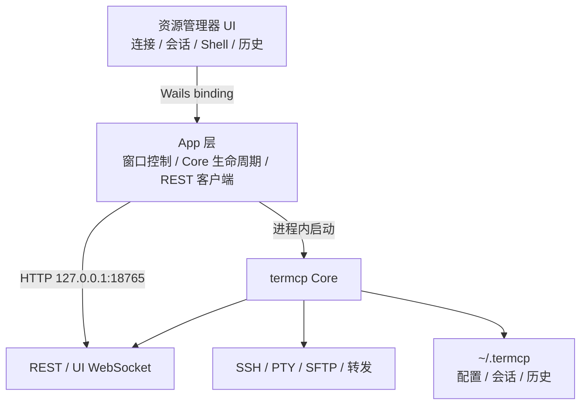

# termcp-gui 架构

## 分层

界面不重新实现 SSH。它只编排 termcp 的连接配置和会话资源。这样 MCP、WebUI 和 GUI 看到同一批会话、Shell、历史与转发。

## Core 生命周期

应用启动时先请求 `/api/sessions`：

1. 请求成功：标记为“外部接入”，只使用 API，退出 GUI 时不关闭 Core。
2. 请求失败：在当前 Go 进程内构造 termcp 的 SSH server、storage、message、history、session、sshconfig、forward、MCP 和 WebUI handler。
3. Core 就绪后：资源管理器从 `/api/connections`、`/api/sessions`、`/api/history`、`/api/forwards` 生成快照。
4. GUI 托管的 Core 退出时：会话标记为 dead，停止内部 SSH 和 MCP HTTP server。

数据目录使用 termcp 自己的 `config.DefaultDataDir()`，因此 GUI 和命令行 Core 遵循相同的 `TERMCP_DATA_DIR` / `~/.termcp` 规则。

## 已完成的纵向切片

- Core 自动接入或进程内启动。
- 读取连接、会话、Shell、历史与转发。
- 创建会话和子 Shell，结束会话，重启托管 Core。
- Wails 原生窗口控制和单应用打包。
- 浏览器脱敏预览及错误状态。

## 后续顺序

1. 接入 `/api/ui/ws` 的终端输出、输入与 resize，验证中文输入法、宽字符、alternate screen、粘贴和持续大输出。
2. 将原型中的工作区标签、嵌套分屏、平铺与窗格最大化迁入实际界面。
3. 接入 SSH 配置编辑、连接测试、跳板配置和安全凭据写入。
4. 接入文件、转发、通知规则和可搜索的历史正文。
5. 增加托盘、开机启动、日志与跨平台安装包。

远程会话的公开 `ssh_endpoint` 当前只返回 `remote`，无法可靠映射回具体连接配置。资源树因此把运行中会话单列，避免在多个连接节点下重复或错误归属；Core API 增加非敏感的连接名称后再建立层级关联。

